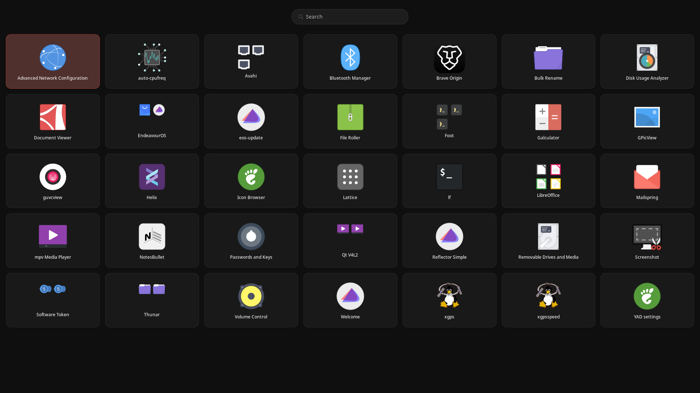

# Lattice

A fast, grid-based application launcher for Wayland, built on GTK3 + layer-shell, with a resident daemon that scans your `.desktop` files and groups related apps automatically.


## What it is

Lattice is two processes:

- **`lattice-daemon`** - a small resident daemon that uses Garcon to scan your `.desktop` files, filters by `OnlyShowIn` / `NotShowIn`, groups related apps by shared name prefix, and writes a compact binary database to `/tmp/lattice/apps.db`.
- **`lattice`** - the UI. It's a GTK3 layer-shell window that reads the daemon's database, draws a grid of app tiles, and launches apps. It stays resident between invocations and re-shows itself when poked with `SIGUSR1`.

The two processes are decoupled: the daemon owns discovery, the UI owns presentation. The UI never touches `.desktop` files directly.

## Features

- **Grid launcher** - fixed-size tiles, 7 per row, scroll and arrow-key navigation.
- **Fuzzy search** - type anywhere to filter; Enter launches the first visible match.
- **Automatic grouping** - apps sharing a whole-word prefix in their name (e.g. `LibreOffice Writer`, `LibreOffice Calc`) collapse into a single group tile with a 2x2 icon preview. Click to drill in; the members appear alongside a Back tile.
- **Layer shell integration** - runs on the top layer, keyboard-exclusive, no decorations, no compositor chrome.
- **Lazy memory** - the UI drops its entire DB cache and destroys all tile widgets when hidden. An idle `lattice` holds only the empty window skeleton.
- **Session-aware daemon** - restarts cleanly when you log into a new session. Stale daemons and UIs are terminated automatically.
- **Right-click a tile** to edit its `.desktop` file (`exo-desktop-item-edit`) or open its containing folder. The daemon rescans after the edit and the UI refreshes.
- **`SIGUSR2`** to the daemon triggers a rescan without restarting it.

## Requirements

- **Wayland compositor** with `wlr-layer-shell` support (`sway`, `Hyprland`, `river`, `wayfire`, `labwc`, etc.)
- **GTK3** development headers
- **gtk-layer-shell** development headers
- **Garcon** (from Xfce) development headers
- **A terminal emulator** if any of your apps require one. `foot` is preferred by default, then `kitty`, `alacritty`, `wezterm`, `gnome-terminal`, `konsole`, `xfce4-terminal`, `xterm`.
- `exo-desktop-item-edit` (from `exo`) if you use the right-click "Edit Launcher" action.
- `xdg-open` for the "Show File" context action.

## Build

### Quick build

```sh
g++ ui.cpp db.cpp -o lattice -std=c++17 -O2 \
    $(pkg-config --cflags --libs gtk+-3.0 gtk-layer-shell-0)

g++ daemon.cpp -o lattice-daemon -std=c++17 -g -O0 \
    $(pkg-config --cflags --libs garcon-1)
```

### Or install to `/usr/local`

```sh
chmod +x install.sh
sudo ./install.sh
```

This builds both binaries, installs them to `/usr/local/bin`, and drops a `.desktop` entry into `/usr/local/share/applications/lattice.desktop` referencing the `view-app-grid` icon.

To uninstall:

```sh
sudo ./uninstall.sh
```

The uninstall script also kills any running `lattice` / `lattice-daemon` processes and removes `/tmp/lattice`.

### User-local install (no root)

```sh
PREFIX="$HOME/.local" ./install.sh
```

## Usage

### First run

```sh
lattice
```

On first launch:

1. `/tmp/lattice` is created with mode `0700`.
2. A session ID is computed from `$XDG_SESSION_ID`, or from `$XDG_SESSION_DESKTOP` + `$DISPLAY`, or from the kernel boot ID as a last resort.
3. If the session ID differs from the one recorded in `/tmp/lattice/session`, any stale daemon and UI are terminated and the directory is wiped.
4. The daemon is spawned if it isn't already running; the UI waits up to 3 seconds for `apps.db` to appear.
5. The UI takes a `flock` on `/tmp/lattice/ui.lock` and writes its PID to `/tmp/lattice/ui.pid`.
6. If another `lattice` is already resident, the new invocation sends it `SIGUSR1` and exits. The resident instance toggles its visibility.

### The context menu

Right-click any app tile:

- **Edit Launcher** - opens the app's `.desktop` file in `exo-desktop-item-edit`. Lattice hides itself while the editor is open, then waits for the editor to exit, pokes the daemon with `SIGUSR2`, waits for `apps.db` to change on disk, and re-shows itself with the updated grid.
- **Show File** - opens the `.desktop` file's parent directory in your file manager.

## How the daemon builds the database

1. Loads the applications menu via `garcon_menu_new_applications()`.
2. Walks every submenu recursively, calling `garcon_menu_item_pool_foreach` on each pool.
3. For each item:
   - Skips it if `garcon_menu_element_get_visible()` is false.
   - Parses the underlying `.desktop` file and checks `OnlyShowIn` / `NotShowIn` against `$XDG_CURRENT_DESKTOP` (falling back to `$XDG_SESSION_DESKTOP`).
   - Extracts name, generic name, comment, exec, try-exec, icon, terminal flag, categories, keywords, and the on-disk path.
   - Deduplicates by `desktop_id` and by `desktop_file`.
4. Groups the remaining apps:

   The grouping rule is intentionally narrow: **whole-word prefixes on `App::name` only**.

   - Tokenise the name on whitespace.
   - For every prefix of the token list (cumulative), count how many distinct apps share it.
   - Assign each app to the *longest* prefix shared by at least two apps. If none exists, the app becomes a singleton group named after itself.
   - Sort group members by name; sort groups by name.

   Examples:

   | Apps | Group |
   |---|---|
   | `Foot`, `Foot Server`, `Foot Client` | `Foot` |
   | `Qt V4L2`, `Qt V4L2 Base`, `Qt V4L2 Test` | `Qt V4L2` |
   | `LibreOffice Writer`, `LibreOffice Calc` | `LibreOffice` |
   | `Firefox` (alone) | `Firefox` |

5. Writes the binary database atomically:

   ```
   magic[8]      "LATTICE1"
   version       u32 = 2
   app_count     u32
   App[app_count]
   group_count   u32
   AppGroup[group_count]
   ```

   Strings are length-prefixed (`u32` length + UTF-8 bytes). Vectors are `u32` count followed by elements. The database is written to `apps.db.tmp`, fsynced, then renamed over `apps.db`. A reader never sees a partial file.

## Contributing

This is a personal tool. Patches welcome but expect strong opinions about the design choices listed above, particularly the binary format, the name-prefix grouping rule, and the "drop everything on hide" memory strategy.
